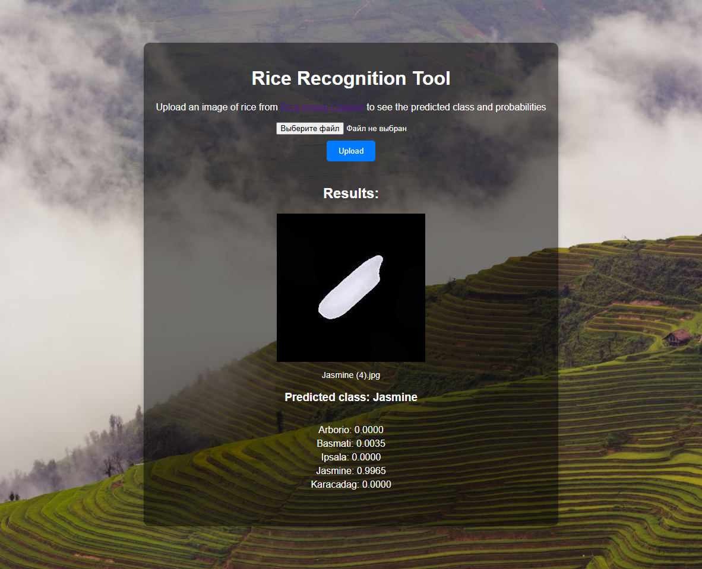

# comp-graph.lab3


[](
https://github.com/Parzival-05/comp-graph.lab3/actions/workflows/tests.yaml)
[](https://github.com/Parzival-05/comp-graph.lab3/actions/workflows/code_style.yaml)

## Overview
This repository contains a comprehensive tool designed to extract various features from rice grain images from the [Rice Image Dataset](https://www.kaggle.com/api/v1/datasets/download/muratkokludataset/rice-image-dataset). Leveraging computer vision techniques, this project focuses on measuring critical attributes of rice grains, including size, brightness, and orientation, and offers a pre-trained [Convolutional Neural Network (CNN) model](model/rice_classification_model.pt) for rice classification. 

- Model description can be found in the [model's README](model/README.md).
- The analysis of the model and some characteristics of the dataset can be found in the [notebook](experiments.ipynb).

Project structure:
- `src` — Contains the core logic for feature extraction and the inference API. This includes:
  - Feature extraction classes for measuring size, brightness, and other attributes of rice grains.
  - The inference API for using the pre-trained CNN model to classify rice images.
- `tests` —  includes unit tests and integration tests for validating the functionality of feature extraction, preprocessing utilities, and the inference API.
-  `templates` — HTML templates for building the web application interface. These templates are used for rendering the web-based inference tool, allowing users to upload rice images and view classification results and extracted features.
-  `static` — Contains static files used by the web application, such as:
   - Images
   - CSS
-  `model` — A directory to store the pre-trained model used for inference.


## Get Started 

### Setup environment

```bash
pip install poetry
poetry install
```
### Install pre-commit hooks (for devs)
```bash
pre-commit install
```

### Download and unzip dataset

```bash
curl -L -o ./rice-image-dataset.zip https://www.kaggle.com/api/v1/datasets/download/muratkokludataset/rice-image-dataset
unzip rice-image-dataset.zip -d ./
```

Then you should have `Rice_Image_Dataset` directory with unpacked dataset.


### Run UI tool for inference

```
poetry run python3 app.py
```
Then go to http://127.0.0.1:5000/.

### Example:


